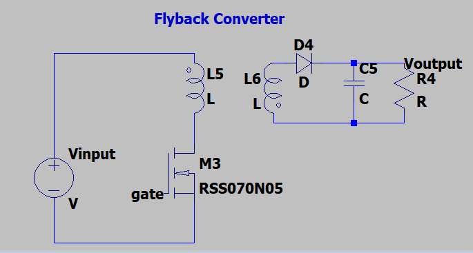
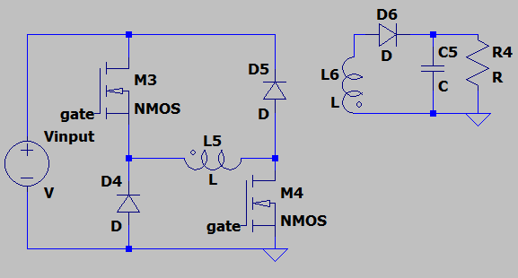
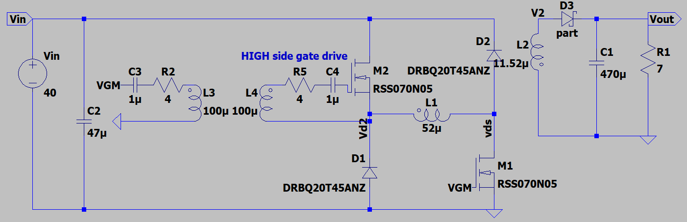
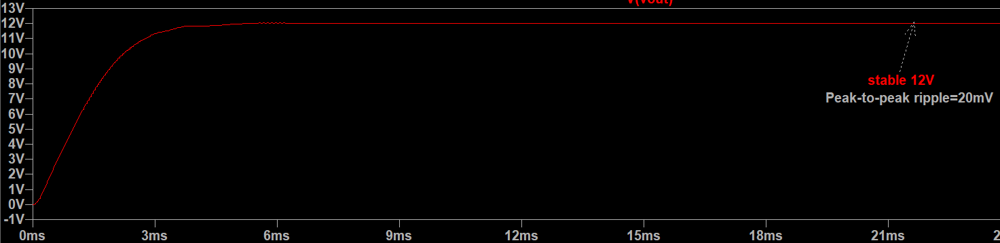
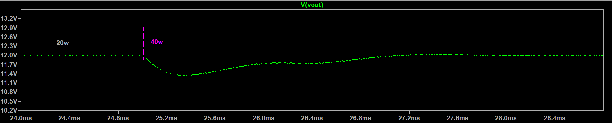
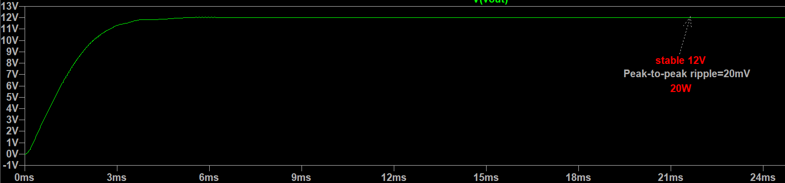

<h2>Specifications</h2>

<ul>
  <li>Vin=40V, Vout=12V</li>
  <li>Iout=3.5A (around 40w)</li>
  <li>Isolated</li>
  <li>Openloop</li>
  <li>Efficiency > 85%</li>
  <li>Vout ripple < 100mv(pp)</li>
</ul>

<h2>Topology selection</h2>

The choice of topology depends on the required properties of the power supply. We first consider practical and safety features required, and these can be explored by studying safety standards set by the IET. For simplicity, we will consider whether we need galvanic isolation or not. This is important in preventing electric shock to the user, especially when the converter is connected to the mains (in which case it would be mandatory). Moreover, the power rating is a significant factor to consider when selecting the optimal toplogy as certain ones are better suited for a range of power values than others. For example, flyback converters have a simple design, but require a large ferromagnetic core to deliver more power without saturating. In such a case, we would opt for toplogies that can deliver the same amount of power with smaller cores, like the Push-Pull converter.

In our case we will need around 40w rating, which will be scaled up to account for inefficiencies by taking the power rating and dividing it by the minimum expected efficiency (85%), giving us 47W. This is a relatively low power converter, so we can go for a Flyback or a Double Switch Forward converter. They offer similar power ratings, however a double switch practically minimises the voltage osccillations seen in a Flyback. I will explain the difference in the section below.

<h2>Single-switched flyback vs double-switched</h2>

  
  

In both converters, a PWM signal switches the single MOSFET in a Flyback (and the two MOSFET's in a Double Switch), and when PWM is ON the primary coil of the transformer is charged. At this stage the diode in the output stage is reverse biased because the secondary voltage is negative , meaning no current flows in the secondary coil. When PWM is OFF, the secondary coil voltage reverses to maintain current flow, forward biasing the diode. The abrupt change of current in the primary coil causes voltage spikes on the MOSFET's drain due to leakage inductance, which need to be dampened in some way to protect the MOSFET. 

If we want to keep the flyback topology, we may consider using a snubber circuit which dissipates the voltage spikes as heat. There are a few snubber circuits we could use like the resistor-capacitor(RC) and resistor-capacitor-diode (RCD), all of which can achieve the desired results to some extent.

The Double switched converter also works in a similar fashion, however it uses two diodes that enter into conduction mode when the primary coil voltage oscillates. This practically wastes less energy and allows the use of MOSFETS with smaller voltage ratings, which are likely to switch faster. The main drawback of this topology is its 50% duty cycle limit, which is in place to prevent MOSFETs from conducting at the same time as the diodes. It also uses more components, however the MOSFET only needs to be rated for Vin. 

Given the limited choice of components, it was more convenient for me to go for the double-switched converter as it requires lower voltage MOSFETs and reduces risk of overvoltage that might occur in a flyback.

<h2>Simulation</h2>

I have used LTSPICE to carry out simulations as it has all the necessary tools. For example, I can model components to get close to practical results which puts me in a better position to build the real circuit.

  

<h3>Modelling a transformer</h3>
To model a transform a coupling command has to be used, which is K (primary inductor) (secondary inductor) (coupling factor). Coupling factor is a value between 0 and 1, and I will set to 0.95 to observe the effects of imperfect coupling (the thing that results in leakage inductance). 

<h3>Components</h3>
The choice of capacitor value ultimately depends on the allowed peak-to-peak output ripple, which is 100mv maximum. Higher capacitance values give more stable voltages, however they result in bigger inrush startup currents. 
All other components were chosen to withstand at least 45 volts to guarantee a safe operation.

Note that the MOSFET gates have been connected to a transformer gate drive. I did not plan on using them for the real circuit, however I needed a realiable way to simulate a high-side gate driver and this is difficult to do with a gate drive model (simulations take much longer!).

<h3>Control</h3>
Although the practical circuit will run in open-loop, I have still modelled a closed-loop PI controller to verify that the required output voltage can be maintained at all power levels. 

The PI controllers can be analytically found using the system's model, however this is not entirely accurate as the circuit is time-varying. This requires a technique called state-space averaging, which is mostly accurate at a selected operating point. For practical reasons, I have used a trial-and-error approach by first tuning the integral gain until steady-state is achieved smoothly, and then optimising the proportional gain to ensure step responses are fast enough.

The PWM generator works by comparing a filtered error signal to a sawtooth waveform, and outputd a HIGH signal only when the error signal is greater than the sawtooth waveform. The frequency of the PWM signal is the same as the sawtooth waveform. 
The reference and read voltage have been scaled down to align with a practical 5v waveform generator, however the comparator needs to output a higher voltage (typically between 12V and 18V) to minimise MOSFETs' on resistance.

  

<h3>Results</h3>

  
  
  

The simulation shows promising steady-state performance and disturbance rejection. It can be particularly seen that a step increase in load causes a dip in voltage for a short time until before it returns to the reference. This is because an increase in current flow discharges the capacitor before the control system acts to deliver more power to it, which it does so reasonably quick.

